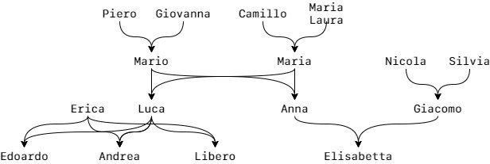

# Family DAG
The following Prolog script tries to define all the relationships involved in the following Family tree:

The relationships found are:
- Father
- Mother
- Son
- Daughter 
- Married
- Brother
- Sister
- Grandmother
- Grandfather
- Aunt
- Uncle
- Cousin
- Mother in law
- Father in law
- Sister in law
- Brother in law
- Ancestor
- Descendant